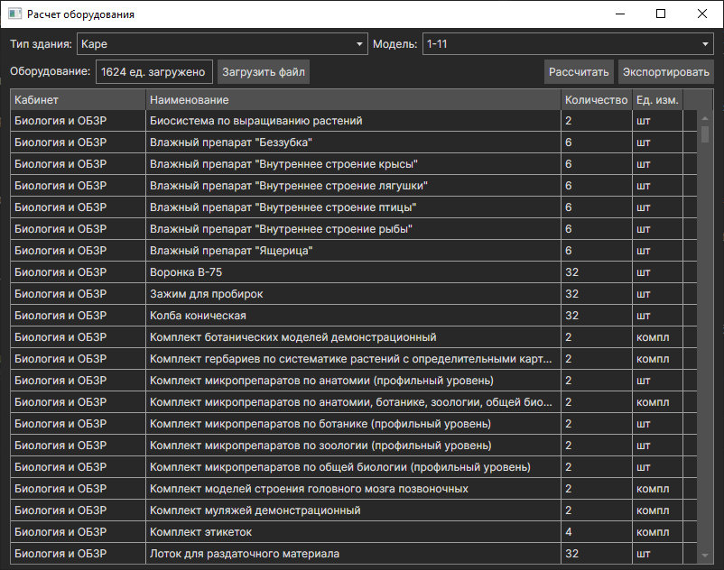

# Программа для распределения оборудования
Работу выполнил Горбунов Глеб 4ИСП9-35

Программа позволяет выбрать модель школы, загрузить .xlsx файл с оборудованием, рассчитать необходимое количество оборудования для заданной модели и экспортировать результат в файл .xlsx.

Модели школ и список возможных кабинетов хранятся в формате JSON, их можно изменить и добавить новые в текстовом редакторе. Подробнее об этом в секции ниже.

Программа собрана для Windows и Linux.



## Запуск
1. Скачать архив с программой со страницы [Releases](https://github.com/jxhrk/EquipmentDistribution/releases)
2. Распаковать архив
3. Запустить файл EquipmentDistribution.exe для Windows и EquipmentDistribution для Linux

## Изменение моделей

Список кабинетов (classrooms.json) хранит возможные названия кабинетов и их ключевые слова для поиска в столбце "Помещение" .xlsx таблицы.

```json
{
  "Classrooms": [
    {
      "Name": "Биология и ОБЗР",
      "Aliases": [
        "биологи",
        "обзр",
        "безопасн",
        "родин"
      ]
    },
    {
      "Name": "Химия",
      "Aliases": [
        "химия",
        "химии"
      ]
    }
  ]
}
```

Виды зданий хранятся в папке SchoolsModels и содержат модели данного вида, а модели - количество предусмотренных в ней кабинетов.
Названия кабинетов должны соответствовать названиям из файла classrooms.json

```json
{
  "Name": "Вертолёт",
  "Models": [
    {
      "Name": "1-6",
      "Classrooms": {
        "Универсальный": 32,
        "Иностранный язык": 4,
        "Биология и ОБЗР": 1,
        "Физика": 0,
        "Химия": 0,
        "Технология информационная": 0,
        "Технология материальная": 2,
        "Информатика": 1
      }
    },
    {
      "Name": "5-11",
      "Classrooms": {
        "Универсальный": 27,
        "Иностранный язык": 4,
        "Биология и ОБЗР": 3,
        "Физика": 2,
        "Химия": 1,
        "Технология информационная": 1,
        "Технология материальная": 2,
        "Информатика": 2
      }
    }
  ]
}
```

## Сборка

Собрать возможно с помощью любой среды разработки либо из терминала

### Windows

`dotnet publish -r win-x64 -p:PublishSingleFile=true --self-contained true`

### Linux

`dotnet publish -r linux-x64 -p:PublishSingleFile=true --self-contained true`